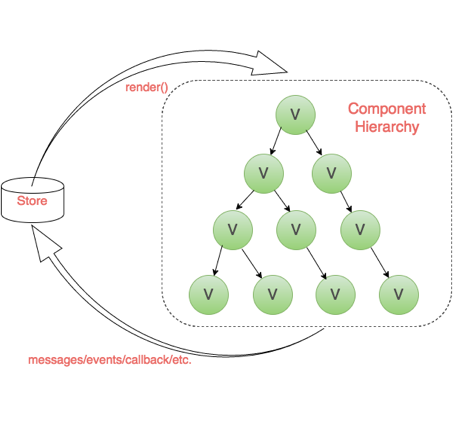
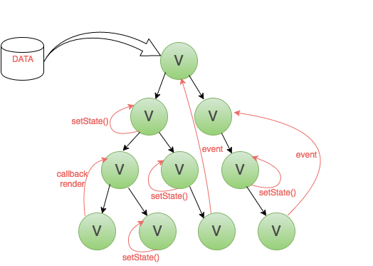

## Redux使用场景
 
以下情况你可能不需要用到redux，用了反而增加代码复杂度：

* 用户的使用方式（交互）非常简单
* 页面之间没有协作&交互（页面不互相影响）
* 不需要与服务器大量交互，也没有使用 WebSocket
* 视图层（View）只从单一来源获取数据

反之：

* 用户的使用方式（交互）非常简单
* 用户的使用方式复杂
* 不同身份的用户有不同的使用方式（比如普通用户和管理员）
* 页面之间有交互，有数据来往（交互上存在父子、子父、兄弟组件间通信，数据也存在跨层、反向的数据流）
* 与服务器大量交互，或者使用了WebSocket
* View要从多个来源获取数据

<!--more-->

另外：

* 随着 JavaScript 单页应用开发日趋复杂，JavaScript 需要管理比任何时候都要多的 state （状态）
* 管理不断变化的 state 非常困难。如果一个 model 的变化会引起另一个 model 变化，那么当 view 变化时，就可能引起对应 model 以及另一个 model 的变化，state 在什么时候，由于什么原因，如何变化已然不受控制

#### 你可能需要用到redux，Redux 试图让 state 的变化变得可预测，数据流向清晰，所有的动作与状态都统一管理

##### 没有使用redux：

##### 使用redux：

UI跟数据和逻辑分离，UI只负责渲染，业务和逻辑交由其它部分处理

## Redux的设计思想
### Flux
Flux 是一种架构思想，Flux最大的特点就是单向数据流；

* View 发出用户的 Action
* Dispatcher 收到 Action，要求 Store 进行相应的更新
* Store 更新后，发出一个"change"事件
* View 收到"change"事件后，更新页面

数据总是"单向流动"，任何相邻的部分都不会发生数据的"双向流动"。

### 概念
Redux的前身就是Flux，它继承了Flux的单向数据流思想，并进行了改进。
Redux是JavaScript状态容器，能提供可预测化的状态管理。
它认为：
* 所有的状态（state），保存在一个对象中（store）。
* Web应用是一个状态机，视图与状态是一一对应的。

三个重要信息：状态容器、视图与状态是一一对应、可预测

Store是Redux中的状态容器，它里面存储着所有的状态数据，每个状态都跟一个视图一一对应。

一个State对应一个View。只要State相同，View就相同，知道了State，就知道View是什么样。